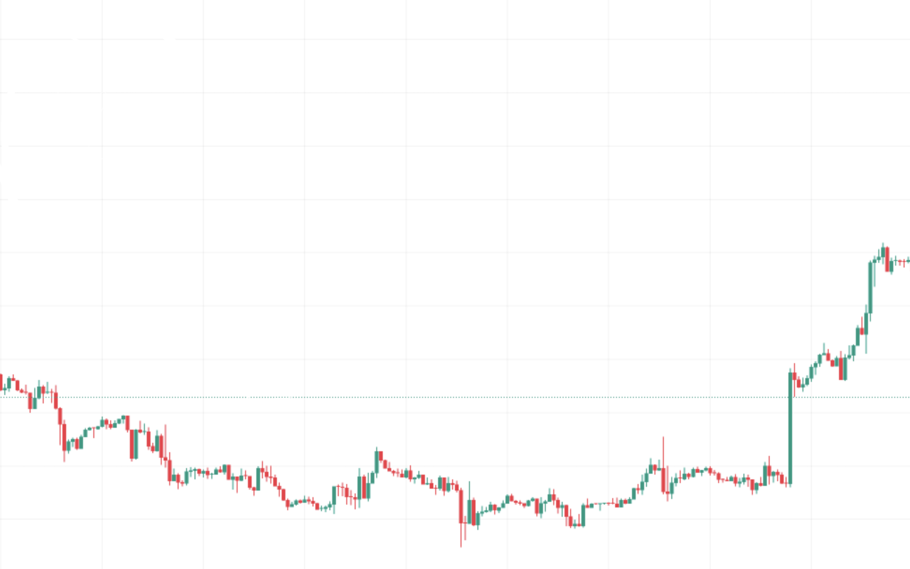

This is a simple interactive web application built with **HTML**, **CSS**, and **JavaScript**, designed to calculate the **future value of an investment** with compound interest and monthly deposits.

## 🧮 Features

- Input fields for:
  - Initial deposit (CZK)
  - Regular monthly deposit (CZK)
  - Investment duration (years)
  - Annual interest rate (% p.a.)
- Calculates total investment value with compound interest.
- Clean, modern design with a background image.
- "Calculate" and "Clear" buttons for easy interaction.
- Output formatted with thousand separators.

## 📷 Screenshot

## 🚀 How to Use

1. Open the `index.html` file in your web browser.
2. Enter the required inputs.
3. Click **Vypočítat** to calculate the final amount.
4. Click **Smazat** to reset all fields.

## 🛠 Technologies Used

- HTML5
- CSS3
- JavaScript (Vanilla)
